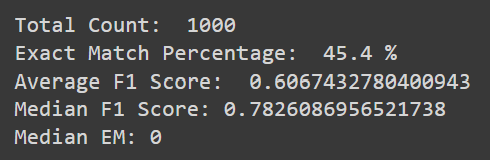
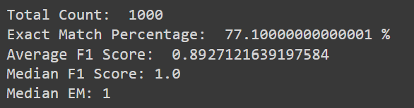

# BERT_QA
## Finetuning BERT LLM on SQuAD(Stanford Question Answering Dataset)

The objective is to fine tune the bert-base-uncased model and compare the performance to the distilbert-base-cased-distilled-squad pretuned model.

### Finetuned model Performance

### Pretuned model Performance

Further comparisons between the case by case performance, techniques to improve the fine tuned model and further actions that can be taken are mentioned in the BERT_QA.pdf 
